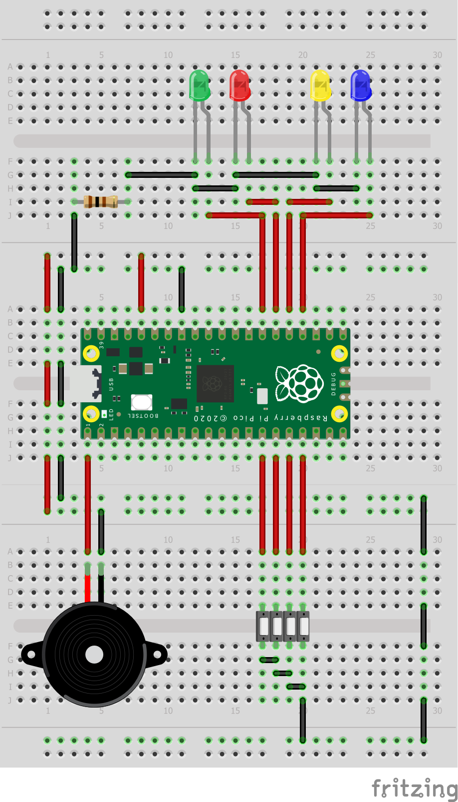

<h1 align="center">Simon Dice - Raspberry Pi Pico</h1>

Este es un proyecto que implementa el famoso juego Simon Dice en una Raspberry Pi Pico utilizando MicroPython.

## Descripción

Simon Dice es un juego de memoria en el que el dispositivo genera una secuencia aleatoria de colores y sonidos, y el jugador debe repetir la secuencia con precisión. Cada vez que el jugador repite correctamente la secuencia, la dificultad aumenta y la secuencia se hace más larga.

Este proyecto utiliza una Raspberry Pi Pico junto con cuatro LED de colores diferentes, cuatro botones, un buzzer pasivo y una protoboard para implementar el juego Simon Dice en MicroPython.

## Materiales

- Raspberry Pi Pico
- 4 Leds de colores diferentes (verde, rojo, amarillo, azul)
- 4 pulsadores normalmente abiertos
- Protoboard
- Cables de conexión
- Buzzer pasivo

## Conexiones

| Pin | Descripcion |
| --- | ----------- |
| GP00 | Buzzer pasivo encargado de generar las melodias|
| GP10 | Pulsador relacionado al led verde |
| GP11 | Pulsador relacionado al led rojo |
| GP12 | Pulsador relacionado al led amarillo |
| GP13 | Pulsador relacionado al led azul |
| GP21 | Led color verde |
| GP20 | Led color rojo |
| GP29 | Led color amarillo |
| GP18 | Led color azul |

```
En la Raspberry, todos los pulsadores están configurados internamente como PULL UP, lo que significa que no es necesario 
hacer una configuración resistiva adicional.

Dado que la salida de voltaje de la Raspberry es de 3V, no es necesario proteger los LED con resistencias adicionales.
```
## Diagrama




[](https://github.com/ycanas)


